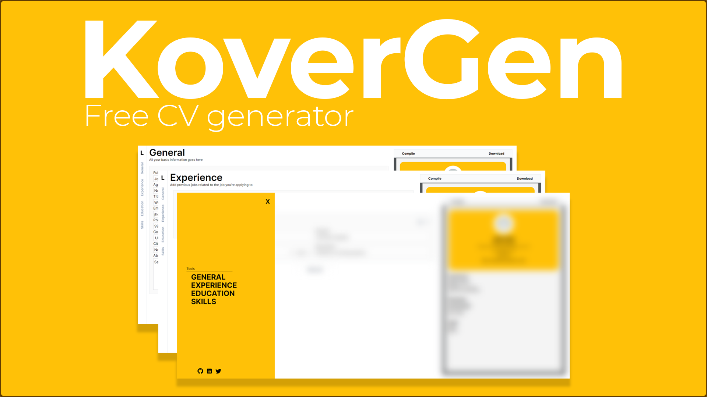

# KoverGen - Free CV Maker



Welcome to my custom built CV generator! This is part of a personal project to improve on web design topics, so if you have any questions or suggestions please feel free to reach to me (check the [contact section](#contact)).

## Versions

Welcome to version 1.0! This represents the MVP (minimum viable product) of the app, so expect new tools in the future. A [live version of the website](https://kovergen.vercel.app/) is available thanks to Vercel. The public webpage will be based on the latest release on the main branch.

# Version 1.0

All basic functions are available on version 1.0, however, there are tweaks being made, so please be patient while I finish polishing things.

- Create, preview and download your CV. Remember to use the **Compile** button to update your CV as this will be the CV that you will get.
- Tap on the **L** icon to display a menu with the different sections, just in case the rotated navbar is not the best option for you.
- Add as many data as you want, new pages will be created. Different templates will be available soon!
- A mobile version is available, however, it's still quite buggy from time to time.

## Running a local copy

> [!CAUTION]
> You are free to clone this repository, however, this is still a work on progress and a lot of changes are being made all the time. The development branch might have bugs, so try working with the main branch instead.

A [live version of the website](https://kovergen.vercel.app/) is available so you don't have to run a local copy really. Even so, in case you might need it feel free to experiment and even contribute to the project!

Clone the repository:

```
git clone https://github.com/kagunecode/cv_generator.git
```

Make sure to have node installed on your local machine and run npm:

```
npm i
```

That will take care of the installation of all the project dependencies. Lastly, run a local server to see the webpage live:

```
npm run dev
```

## Contact

Feel free to contact me for any reasons at **cesar.acb98@gmail.com** or at any of my social media:

- [X](https://twitter.com/officialkagune)
- [LinkedIn](https://www.linkedin.com/in/cesar-augusto-cruz-benitez-76a935127/)
- [Instagram](https://www.instagram.com/kagunemusic/)
